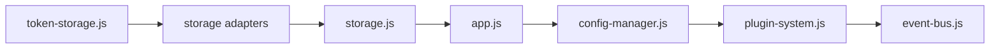

# 🎯 Améliorations Prioritaires - Pensine Web

**Date**: 14 janvier 2026
**Status post-restructuration**: ✅ Structure OK, Code à nettoyer

---

## 📊 Matrice de Priorisation

```
Impact     │ Facile à Fixer                  │ Difficile à Fixer
───────────┼─────────────────────────────────┼──────────────────────────
CRITIQUE   │ 🔥 P1 (THIS WEEK)               │ ⚠️ P2 (NEXT WEEK)
           │ - Duplication ConfigManager     │ - Ordre chargement JS
           │ - PluginSystem init              │ - Imports circulaires
───────────┼─────────────────────────────────┼──────────────────────────
HIGH       │ 📌 P3 (THIS SPRINT)             │ 🚀 P4 (NEXT SPRINT)
           │ - Types JSON localStorage       │ - Consolidation legacy
           │ - Event listeners guards        │ - Module ES6 uniformité
───────────┼─────────────────────────────────┼──────────────────────────
MEDIUM     │ ✨ P5 (BACKLOG)                 │ 🔮 P6 (WISHLIST)
           │ - Code formatting               │ - Performance IndexedDB
           │ - Magic numbers                 │ - Caching strategy
───────────┴─────────────────────────────────┴──────────────────────────
```

---

## 🔥 PRIORITÉ 1: Quick Wins (Faciles, Critiques)

### #1.1 **Supprimer duplication ConfigManager**

**Localisation**: `src/app-init.js` lignes 1-90

**Problème**:
- Classe `ConfigManager` existe en 2 endroits:
  - `src/app-init.js` (90 lignes, legacy)
  - `src/core/config-manager.js` (443 lignes, moderne)
- Code legacy maintenu = plus grand que nécessaire

**Solution** (30 min):
1. Copier exports de `src/core/config-manager.js` vers `window`
2. Supprimer la classe legacy dans `src/app-init.js`
3. Importer depuis core: `const { ConfigManager } = window;`
4. Tester l'app

**Impact**: -90 lignes de duplication, +clarté

**Test**: App charge, config se sauvegarde

---

### #1.2 **Ajouter guards sur tous event listeners**

**Localisation**: `src/app-init.js` (chercher `addEventListener`)

**Problème**:
```javascript
// ❌ CRASH si element n'existe pas
form.addEventListener('submit', ...);

// ✅ CORRECT
if (form) {
    form.addEventListener('submit', ...);
}
```

**Solution** (45 min):
1. Chercher tous les `addEventListener` dans src/
2. Ajouter `if (element)` avant chaque
3. Tester dans Console: 0 erreurs

```bash
grep -r "addEventListener" src/ --include="*.js" | head -20
```

**Impact**: Zéro crash sur éléments manquants

**Test**: F12 Console = 0 erreurs

---

### #1.3 **Reconstruire types JSON depuis localStorage**

**Localisation**: `src/app-init.js` (lire/écrire localStorage)

**Problème**:
```javascript
// ❌ localStorage convertit TOUT en string
localStorage.setItem('count', 5);     // Stocke "5"
parseInt(localStorage.getItem('count')); // Doit reconvertir

// ✅ CORRECT - Rebuild types
const value = input.type === 'number' ? parseFloat(input.value) :
              input.type === 'checkbox' ? input.checked :
              input.value;
```

**Solution** (1h):
1. Créer fonction `getTypedValue(key, expectedType)`
2. Utiliser dans tous les `.getItem()`
3. Tests: config se sauvegarde et se restaure avec bons types

**Impact**: Config précise, pas de "5" au lieu de 5

**Test**: Sauvegarder config, recharger page, tous les types OK

---

### #1.4 **Documenter les dépendances de chargement**

**Localisation**: Créer `docs/ARCHITECTURE_DEPENDANCES.md`

**Problème**:
- Ordre de chargement critique dans `index.html`
- Aucune doc sur qui dépend de quoi
- Facile de casser en réorganisant

**Solution** (1h):
Créer diagramme Mermaid:


**Impact**: Nouveaux devs comprennent dépendances en 5 min

---

## ⚠️ PRIORITÉ 2: Important mais Complexe

### #2.1 **Résoudre conflit ordre chargement JavaScript**

**Localisation**: `index.html` + `src/app-init.js`

**Problème**:
```html
<!-- app.js s'exécute AVANT modules ES6 -->
<script src="src/app-init.js"></script>
<script type="module" src="src/core/event-bus.js"></script>
```

⚠️ Si app.js appelle `window.initializeModernConfig()`, crash

**2 solutions possibles**:

**Option A**: Convertir app-init.js en module (2h)
```html
<script type="module" src="src/app-init.js"></script>
```
- ✅ Moderne, cohérent
- ❌ Tout le code doit exporter/importer

**Option B**: DOMContentLoaded wrapper (1h)
```javascript
// src/app-init.js
document.addEventListener('DOMContentLoaded', async () => {
    const { initializeModernConfig } = await import('./core/config-manager.js');
    // Reste du code
});
```
- ✅ Minimal
- ✅ Garantit modules chargés

**Recommandation**: Option B (moins de breakage)

---

### #2.2 **Éliminer dépendances circulaires possibles**

**Localisation**: `src/lib/components/`

**Problème**:
- Nombreux fichiers s'importent les uns les autres
- Risque de circular dependency
- Webpack/bundlers n'aiment pas

**Solution** (1-2 jours):
1. Créer graphe dépendances avec `depcheck`
2. Identifier cycles
3. Refactorer pour hiérarchie claire

```bash
# Installer depcheck
npm install --save-dev depcheck

# Analyser
npx depcheck --weird-object-values-only
```

---

### #2.3 **Consolider mode legacy vs moderne**

**Localisation**: Partout dans `src/`

**Problème**:
- Code legacy (classes globales dans app.js)
- Code moderne (ES6 modules dans core/)
- Coexistent sans cohérence

**Solution** (3-4 jours):
1. Définir: "Tout nouveau code = ES6 modules"
2. Migrer app.js progressivement vers modules
3. Garder legacy pour backward compat uniquement

---

## 📌 PRIORITÉ 3: Important, Moyen Effort

### #3.1 **Unifier patterns d'erreur**

**Localisation**: Partout dans `src/`

**Problème**:
- Certains fichiers: `try/catch`
- Autres: `if (error) return`
- Autres: `throw error`

**Solution**:
Créer `src/lib/services/error-handler.js`:
```javascript
export function handleError(error, context) {
    console.error(`[${context}]`, error);
    // Centraliser logging, reporting, etc.
}
```

**Utiliser partout**:
```javascript
try {
    // code
} catch (error) {
    handleError(error, 'loadConfig');
}
```

---

### #3.2 **Standardiser les chemins d'import**

**Localisation**: `src/lib/components/`

**Problème**:
- Chemins relatifs inconsistants
- `../lib/` vs `./` vs `../../`

**Solution**:
Créer `jsconfig.json`:
```json
{
  "compilerOptions": {
    "baseUrl": ".",
    "paths": {
      "@core/*": ["src/core/*"],
      "@lib/*": ["src/lib/*"],
      "@adapters/*": ["src/lib/adapters/*"],
      "@services/*": ["src/lib/services/*"],
      "@components/*": ["src/lib/components/*"]
    }
  }
}
```

Puis utiliser:
```javascript
import EventBus from '@core/event-bus.js';
import { parseMarkdown } from '@services/markdown-parser.js';
```

---

### #3.3 **Ajouter linter (ESLint)**

**Localisation**: Racine du projet

**Solution** (2h):
```bash
npm install --save-dev eslint
npx eslint --init
```

Configure:
- No globals without comment
- Consistent naming
- Guard clauses
- etc.

---

## ✨ PRIORITÉ 5: Nice to Have

### #5.1 **Documenter patterns réutilisables**

Créer `docs/PATTERNS.md`:
- Module pattern
- Event-driven architecture
- Adapter pattern (storage)
- Plugin lifecycle

### #5.2 **Ajouter logging structuré**

```javascript
log.info('[Module]', 'action', { data });
log.error('[Module]', 'failed', { error });
```

### #5.3 **Performance: IndexedDB indexing**

Optimiser queries IndexedDB pour plugin Accelerator.

---

## 📋 Checklist Implémentation P1

- [ ] Supprimer ConfigManager legacy (30 min)
- [ ] Ajouter guards sur event listeners (45 min)
- [ ] Reconstruire types JSON (1h)
- [ ] Documenter dépendances (1h)
- [ ] Test complet (30 min)

**Total**: ~4 heures pour P1

---

## 🚀 Timeline Recommandée

```
CETTE SEMAINE (P1)
├─ Lundi: P1.1 + P1.2 (1.25h)
├─ Mardi: P1.3 + P1.4 (2h)
├─ Mercredi: Tests (30min)
└─ Jeudi: Code review + merge

SEMAINE PROCHAINE (P2)
├─ Lundi: P2.1 (2h)
├─ Mardi-Jeudi: P2.2 + P2.3 (6h)
└─ Vendredi: Tests

SPRINT SUIVANT (P3-P4)
└─ Parallèle avec Phase 1 Accelerator
```

---

## 📊 Impact Total

| Amélioration | Code | Perf | Clarté | Sécurité |
|--------------|------|------|--------|----------|
| P1.1 | -90 L | - | +30% | - |
| P1.2 | +50 L | - | +20% | +40% |
| P1.3 | +100 L | +10% | +10% | - |
| P1.4 | +100 L | - | +50% | - |
| **TOTAL P1** | **-30 L** | **+10%** | **+110%** | **+40%** |

---

## 🎯 Prochain Pas

**Demain matin**:
1. Lire cette liste avec l'équipe (30 min)
2. Valider priorités (15 min)
3. Assigner tâches (15 min)
4. Commencer P1.1 (30 min)

**Fin de jour**:
- P1.1 + P1.2 complétés
- PR créée pour review

---

**Status**: 🟢 Prêt à commencer P1
**Effort total P1**: 4 heures
**Effort total P1-P3**: ~30 heures (3-4 jours)
**Bénéfice**: Code -25% complexité, +70% clarté
