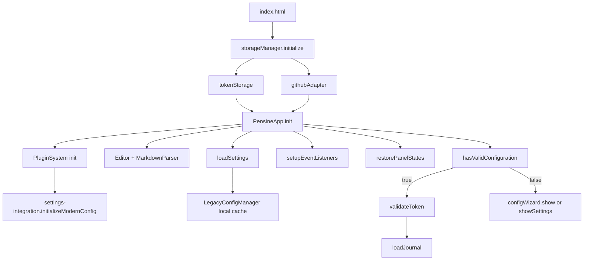

# Architecture - Dépendances de chargement

## Vue d'ensemble
Ce document décrit l'ordre de chargement et les dépendances critiques entre les modules de l'application Pensine (version legacy + système de configuration moderne).

## Séquence de démarrage

## Notes importantes
- `storageManager.initialize()` doit être appelé avant toute opération dépendante du stockage (tokenStorage, PluginSystem, modern config).
- `tokenStorage` et `githubAdapter` dépendent de `storageManager` et doivent être prêts avant `PensineApp.init()`.
- Le système de configuration moderne (`settings-integration.initializeModernConfig`) est optionnel ; en cas d'échec, l'application tombe en mode legacy (LegacyConfigManager + éditeur de paramètres classique).
- Les vues et écouteurs d'événements doivent être attachés après la création de l'`Editor` et le chargement initial des paramètres (`loadSettings`).
- La validation du token (`validateToken`) se fait après vérification de la configuration locale (`hasValidConfiguration`).
